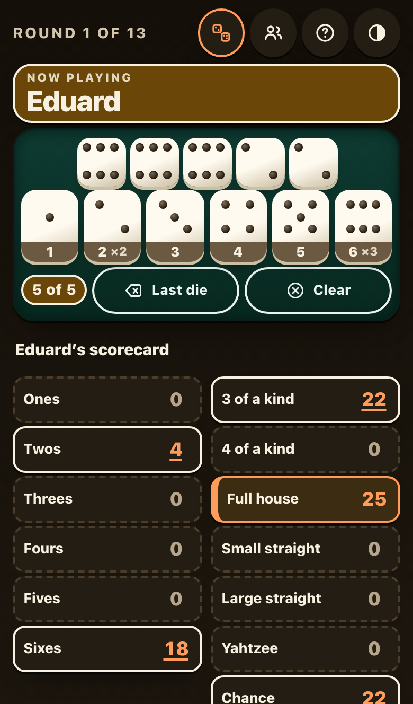
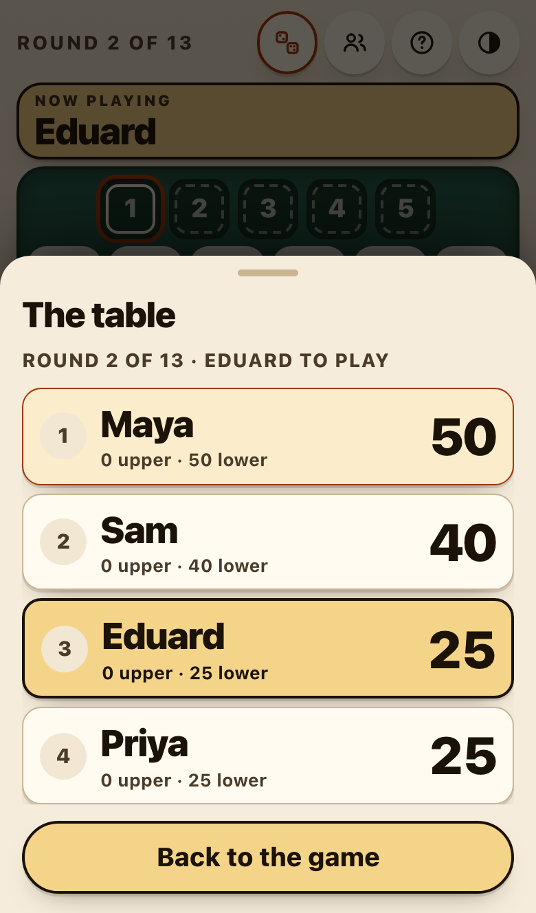
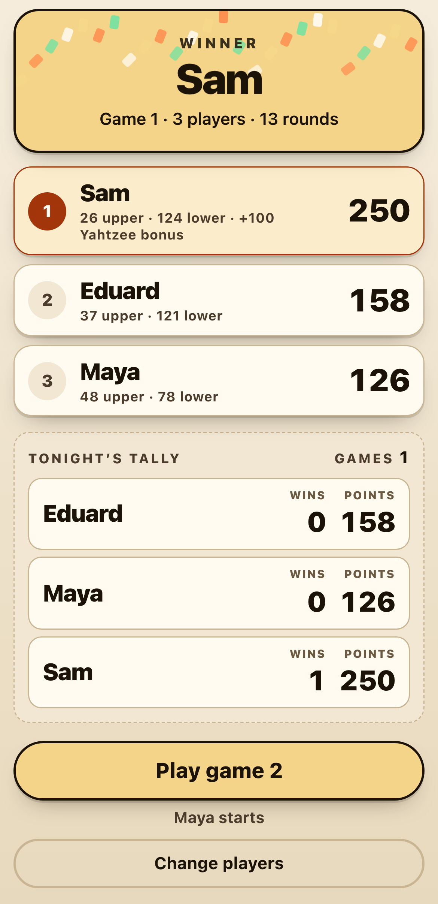

# Camp Yahtzee

**▶ Play: https://eduardkakosyan.github.io/yahtzee/** (on an iPhone: open in Safari → Share → *Add to Home Screen*)

> ### Built end to end by an autonomous agent running a local model
> Nobody wrote this app by hand, and no cloud AI wrote it either. Every line of code, test, icon and design decision in this repository's history (18 commits) was produced by **Qwen3.8-Flash-Next**, an open-weights model running **locally on a single NVIDIA DGX Spark**. It worked unattended inside [**dgx-autonomy**](https://github.com/EduardKakosyan/dgx-autonomy), a self-governing build loop.
>
> People supplied the brief and two rounds of product feedback: what a player sees, never how to code it. The agent planned, coded, tested, looked at its own screenshots, fixed its own bugs and committed its work, over about 24 hours of wall-clock time and four fresh conversations. Nobody answered its questions. It was graded by frozen acceptance checks it couldn't change.

<p>
  
  
  
</p>

## What it is

Official-rules Yahtzee for **one phone passed around a table of friends**. It was made for a camp trip with no signal.

- **1–8 players** take turns in seating order, with a big "Now playing" banner and a live scoreboard.
- **Roll real dice at the table, or on the phone.** In real-dice mode you tap in the five faces you rolled, and the app scores every box for you, so nobody does arithmetic and nobody gets the rules wrong.
- **The official rules exactly:** the 35-point upper bonus at 63, the 100-point bonus for every extra Yahtzee, and the forced Joker placement rules.
- **Game after game:** "Play game 2" keeps the same friends, rotates who starts, and keeps a running tally of wins and points for the evening.
- **Undo** for the last recorded box, and a standings sheet readable from across the table.
- **Works offline** once it's on your home screen. It resumes exactly where you were if the phone locks or Safari reloads. Light and dark themes, and phone-first down to an iPhone SE.

### Put it on an iPhone

1. Open **https://eduardkakosyan.github.io/yahtzee/** in Safari while you have signal.
2. Share → **Add to Home Screen**.
3. Open it once from the home-screen icon while still online, so it caches itself.
4. In setup, pick **"Real dice at the table"** if you're using real dice. The phone remembers the choice.

It then plays with no connection at all. Scores live on that one phone.

## How an agent built it

The loop gave the builder a written brief and a set of frozen, executable acceptance checks, then left it alone for up to 40 hours:

| | |
|---|---|
| **Builder** | Qwen3.8-Flash-Next (open weights, NVFP4), served locally by SGLang on one DGX Spark, driving an OpenHands agent in a locked-down sandbox |
| **Input** | [`loop/brief.md`](loop/brief.md) and [`loop/checks/`](loop/checks/) (24 Playwright tests: rules, Joker, whole games, session tally, reload resume, offline install, and contrast, tap-target and overflow on two iPhone sizes) |
| **Human involvement** | Two product-feedback messages, verbatim in [`loop/operator-messages.md`](loop/operator-messages.md): "we roll real dice, the phone keeps score", then "the keypad faces hide a pip". No code review, no code help. |
| **What the agent did on its own** | Wrote a pure rules engine with 24 unit tests, including a check of all 7,776 possible rolls against an independent oracle, then the UI, the service worker and the icons. It wrote its own audit scripts (contrast, tap targets, overflow, full-game replays, offline) and fixed what they found. It kept notes for its future self in [`AGENTS.md`](AGENTS.md) and carried its work across four fresh conversations when its context filled up. |
| **Grading** | When the agent said "done", the environment ran the frozen checks in separate containers against the running app. Both claims passed 24/24. Real-dice mode was then played through as whole games (3 and 8 players, 143 turns, every box value checked against an independent rules implementation) with zero discrepancies. |
| **Timeline** | Launched 28 Sep 2026 13:12 UTC; first claim 22:56; final claim after feedback 29 Sep 13:10 UTC |

The git history is the agent's, unedited. The only human-side commit is the last one, which adds this README, the loop record (`loop/`), the screenshots and the Pages workflow. The agent's own README is kept at [`docs/builder-readme.md`](docs/builder-readme.md).

## Run it yourself

```sh
node serve.mjs public 3000                       # the built app: http://localhost:3000
node build.mjs                                   # rebuild public/ from src/
node --test tests/rules.test.js tests/rules-oracle.test.js   # the agent's unit tests
npm install && npx playwright install chromium
APP_URL=http://localhost:3000 npx playwright test          # the frozen acceptance checks
```

## Part of dgx-autonomy

This is one of the apps built in [**dgx-autonomy**](https://github.com/EduardKakosyan/dgx-autonomy), alongside [**Shoreline**](https://github.com/EduardKakosyan/shoreline) (beach and fishing conditions, [live](https://eduardkakosyan.github.io/shoreline/)). See that repo for how the loop works: the sandbox, the frozen checks, the context handoffs and the operator's log.
